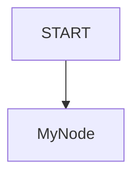
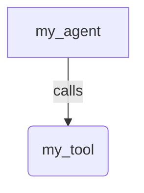

# Sample README structure

Every sample gets a `README.md` with these sections, in this order.

## Overview

What the sample does and which feature or pattern it exists to demonstrate.

## Sample Inputs

Prompts a reader can paste in to exercise the sample. Wrap each prompt in
backticks. If a prompt needs an explanation, leave a blank line between the
prompt and the explanation and indent the explanation by two spaces — without
the blank line Markdown folds them into one list item.

## Graph

A Mermaid diagram of the structure, not of the request/response flow.

-   For a `Workflow` root agent, draw the graph of nodes and edges.
-   For an agent that orchestrates tools or sub-agents (`LlmAgent`,
    `ManagedAgent`), draw the topology of the agent and its tools/sub-agents
    instead of internal workflow nodes.

Keep it to a few nodes and edges. A `user -> agent -> API -> tool -> user`
sequence diagram is noise: it says nothing the topology does not.

## How To

The key techniques the sample uses (for example `ctx.run_node`), with the few
lines of code that show each one.

## Related Guides

Links to the guides under `docs/guides/` that explain the classes used, each
with a one-line summary. From a sample at
`contributing/samples/{category}/{sample_name}/` the guides are four levels up:

```markdown
- [Workflow](../../../../docs/guides/workflow/workflow/index.md) - Explains building complex multi-step graphs.
```

## Template

````markdown
# ADK Sample Name

## Overview

Brief description.

## Sample Inputs

- `Prompt example 1`

- `Prompt example 2`

  *Explanation or expected behavior*

## Graph

For a Workflow root agent:



For an agent orchestrating tools or sub-agents:



## How To

Explain the details.

## Related Guides

- [Guide Title](../../../../docs/guides/path/to/guide.md) - Brief description of what the guide covers.
````
