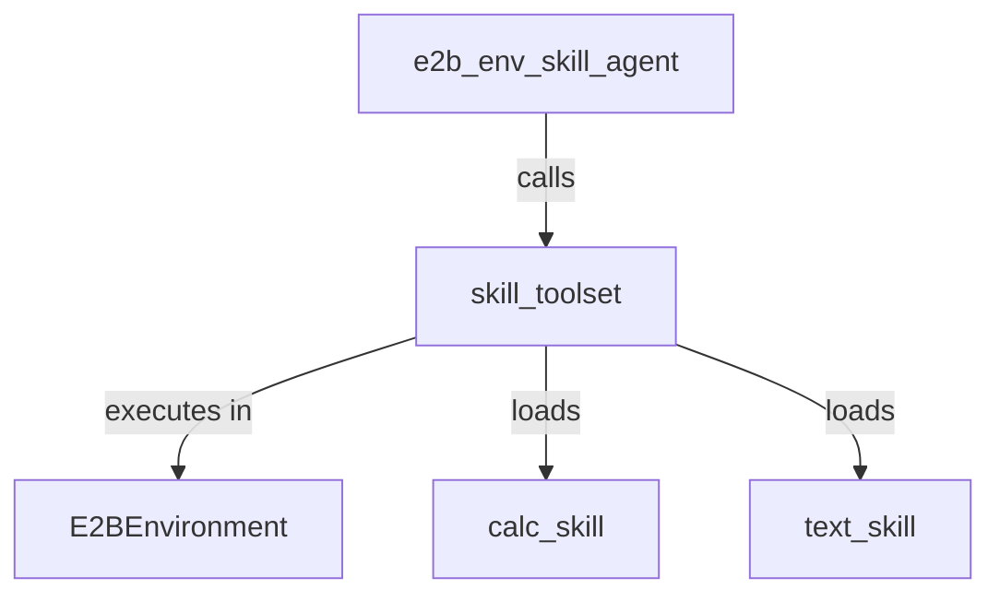

# E2B Environment Skill Toolset

## Overview

Demonstrates how to configure a standalone ADK agent with `SkillToolset` backed by directory-loaded `Skill` objects and an `E2BEnvironment` for remote sandbox script execution.

## Sample Inputs

- `Calculate 10 plus 5`

  *Runs calculate.py inside an isolated E2B remote sandbox via run_skill_script with '--op add --a 10 --b 5'*

- `Format 'hello world' in uppercase`

  *Executes format.sh inside an E2B remote sandbox to format the text in uppercase*

## Graph

## How To

To execute skill scripts inside an isolated remote sandbox without running code on the user's local machine:

1. Load all skills from a directory using `load_skills_from_dir` (each skill folder contains a `SKILL.md` and a `scripts/` directory with executable scripts).
1. Instantiate `SkillToolset(skills=skills, environment=E2BEnvironment())`.
1. Provide the toolset to an `Agent` instance via `tools=[skill_toolset]`. When the agent invokes `run_skill_script`, the script resources are JIT-materialized into `skills/<skill_name>/` within the remote sandbox and executed directly via `E2BEnvironment.execute()`.

## Related Guides

- [E2B Environment Sample](../e2b_environment/README.md) - Demonstrates using `E2BEnvironment` with `EnvironmentToolset` for remote sandbox execution.
- [ADK Skills Agent Sample](../skills/README.md) - Overview of Skills and `SkillToolset` in ADK.
