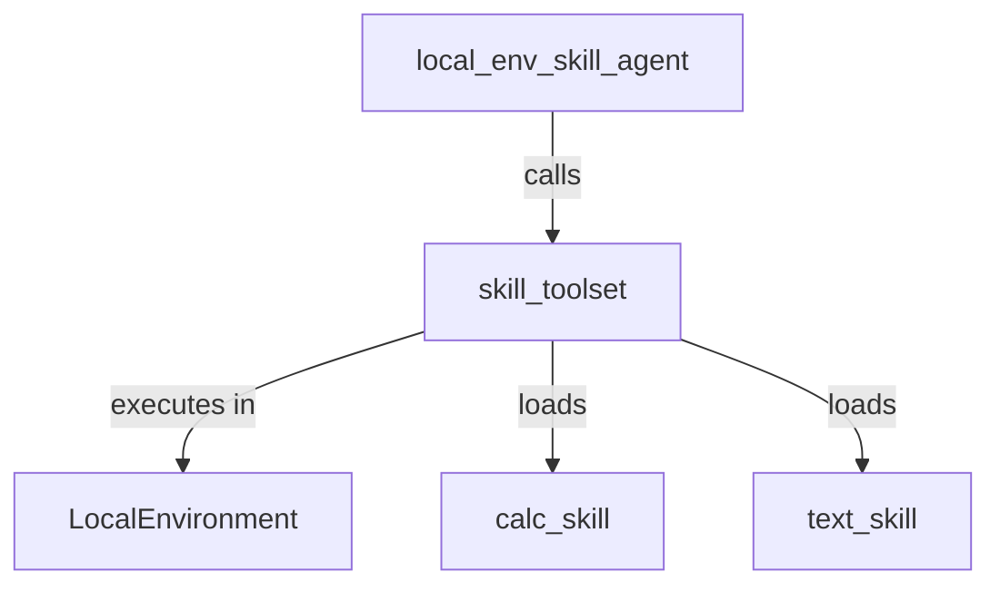

# Local Environment Skill Toolset

## Overview

Demonstrates how to configure a standalone ADK agent with `SkillToolset` backed by directory-loaded `Skill` objects and a `LocalEnvironment` for script execution.

## Sample Inputs

- `Calculate 10 plus 5`

  *Runs calculate.py in the local environment via run_skill_script with '--op add --a 10 --b 5'*

- `Format 'hello world' in uppercase`

  *Executes format.sh in the local environment to format the text in uppercase*

## Graph

## How To

To execute skill scripts within a local environment without requiring a code executor:

1. Load all skills from a directory using `load_skills_from_dir` (each skill folder contains a `SKILL.md` and a `scripts/` directory with executable scripts).
1. Instantiate `SkillToolset(skills=skills, environment=LocalEnvironment())`.
1. Provide the toolset to an `Agent` instance via `tools=[skill_toolset]`. When the agent invokes `run_skill_script`, the script resources are JIT-materialized into `skills/<skill_name>/` and executed directly by `LocalEnvironment.execute()`.

## Related Guides

- [Local Environment Sample](../local_environment/README.md) - Demonstrates executing commands locally using `LocalEnvironment`.
- [ADK Skills Agent Sample](../skills/README.md) - Overview of Skills and `SkillToolset` in ADK.
