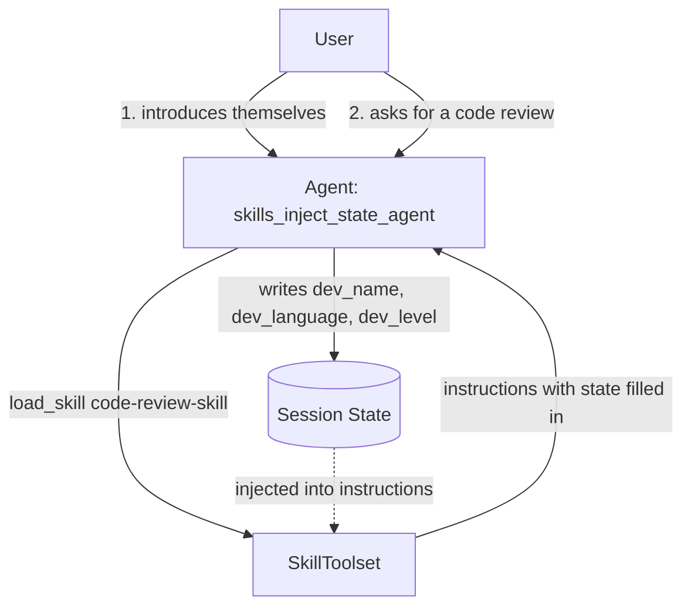

# ADK Skill State Injection Sample

## Overview

This sample demonstrates **session state injection** into a skill via the
`adk_inject_state` metadata flag.

Without this flag, a skill that needs to read a value the agent already
holds — a user preference, conversation context, or any other state value —
has to ship its own custom "getter" tool, wire it through
`SkillToolset(additional_tools=[...])`, and instruct the model to call it. That
is extra application code plus an extra LLM round-trip at runtime, just to read
state.

`adk_inject_state` removes that boilerplate. When a skill's `SKILL.md`
frontmatter sets `metadata.adk_inject_state: true`, `LoadSkillTool` renders the
skill body through `inject_session_state` at load time, substituting any
`{placeholder}` with the matching value from session state. It is the same
`{var}` / `{var?}` interpolation that `LlmAgent.instruction` already supports —
now available to skills as a one-line, declarative change.

This sample showcases:

1. **Opting into injection**: Setting `metadata.adk_inject_state: true` in
   `SKILL.md`.
1. **Declarative state access**: Referencing session state directly with
   `{dev_name}`, `{dev_language}`, and `{dev_level}` placeholders — no getter
   tool required.
1. **Populating state**: A `remember_developer_profile` tool that writes the
   profile into session state, which the skill later reads via injection.
1. **State freshness**: Understanding that state values are materialized at
   skill load time; subsequent state changes do not affect an already-loaded
   skill unless it is reloaded.

## How It Works



## Sample Inputs

Run from the parent directory:

```shell
adk web
```

Then, in a single session, send these turns in order:

1. `Hi, I'm Alex. I mainly write Python and I'm a senior engineer.`

   *The agent calls `remember_developer_profile`, storing the profile in
   session state.*

1. `Can you review this for me?  def add(a, b): return a+b`

   *The agent loads `code-review-skill`. Because the skill opts into
   `adk_inject_state`, the `{dev_name}` / `{dev_language}` / `{dev_level}`
   placeholders are already filled in from state when the instructions are
   returned — no separate tool call was needed to read the profile.*

## Placeholder Syntax

Placeholders map to session state keys:

- `{key}` — required; injection fails if the key is missing.
- `{key?}` — optional; replaced with an empty string if the key is missing.
- `{user:key}`, `{app:key}`, `{temp:key}` — read prefixed
  (user-/app-/temp-scoped) state.

This sample uses the optional form (`{dev_name?}`) so that loading the skill
before a profile has been set degrades gracefully instead of erroring.

## State Freshness & Best Practices

- **Materialized at load time**: State values are resolved and injected once
  when `load_skill` is called. If session state changes later during the session,
  the instructions already returned into the conversation context do not
  automatically update.
- **Set state before loading**: Ensure any required session state values are
  populated before the model loads the skill.
- **Dynamic or mutable state**: For values that change continuously during task
  execution, prefer standard getter tool calls or explicitly reload the skill
  rather than relying on one-time injection at load time.
