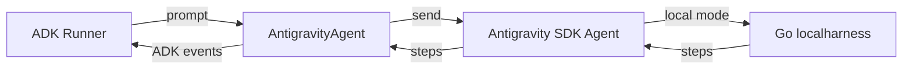

# Antigravity SDK Game Developer Agent

## Overview

This sample wraps a pre-configured [Google Antigravity SDK](https://pypi.org/project/google-antigravity/)
agent as a native ADK agent using `AntigravityAgent`, configured as a
**game developer** that writes small, runnable browser games into the
`game_repo/` workspace as single self-contained HTML files. Each turn is
delegated to the Antigravity
runner, and its trajectory steps (model text, tool calls, and tool responses)
are streamed back as standard ADK events recorded in the session.

This sample uses `AntigravityAgent` as a **standalone ADK root agent**. It may
also have ADK `sub_agents` of its own, and may itself be nested under an ADK
parent if it sets `mode='single_turn'`. See the
[AntigravityAgent guide](../../../../docs/guides/labs/antigravity/index.md)
for the full setup, limitations, and API details.

## Prerequisites

- Install the Antigravity SDK: `pip install "google-adk[antigravity]"`
- Set a Gemini API key: `export GEMINI_API_KEY="your-api-key"`
  (required by the Antigravity SDK, which drives the model)

The Antigravity agent writes generated games into a `game_repo/` directory, and
points the Antigravity SDK's `save_dir` at a `trajectories/` directory so the
harness keeps its own scratch files there rather than in a fresh temporary
directory per connection.
Both sit next to `agent.py` and are created automatically on import.

## Sample Inputs

- `Create a playable Snake game.`

  The agent writes a self-contained HTML implementation into `game_repo/` (e.g.
  `game_repo/snake.html`, with inline CSS and JavaScript) using the built-in
  `create_file` tool, then explains how to open it in a browser.

- `Create a 2-player turn-based Artillery game with adjustable angle and power.`

  The agent writes another self-contained HTML game (e.g.
  `game_repo/artillery.html`) with canvas rendering and projectile physics.

- `Create a Brick Breaker game.`

  The agent writes a self-contained HTML implementation (e.g.
  `game_repo/brick_breaker.html`) with a paddle, ball, and breakable bricks.

## Graph

Each turn, the wrapper delegates to the Antigravity agent's local Go harness
and maps the trajectory steps it streams back into ADK events:



## How To

The wrapper takes a `google.antigravity.LocalAgentConfig` via the `config`
argument:

```python
root_agent = AntigravityAgent(
    name="antigravity_game_developer",
    description="...",
    config=_sdk_config,
)
```

The Antigravity agent enables its built-in file tools by default; the
`policy.workspace_only([...])` policy keeps all file reads and writes contained
to `game_repo/`. Internally, `AntigravityAgent` runs each turn on a fresh
Antigravity SDK `Agent`, resuming the conversation the previous turn created:
the conversation id is kept in ADK session state, so resumption survives a
process restart. Each turn sends the latest user prompt and converts each
streamed Step into ADK events.

The root-only restriction is enforced at construction time: adopting the
Antigravity agent under an ADK parent raises a `ValueError` unless it sets
`mode='single_turn'`. Giving it `sub_agents` is allowed -- each ADK child is
bridged to the Antigravity harness as a client-side tool, so each child needs a
non-empty `description`.
