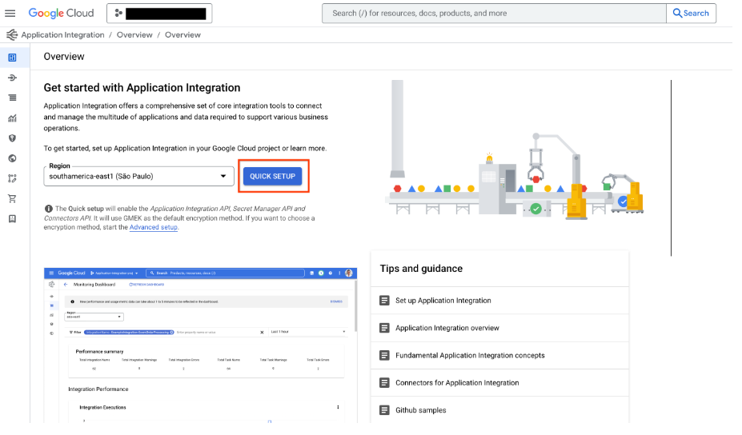
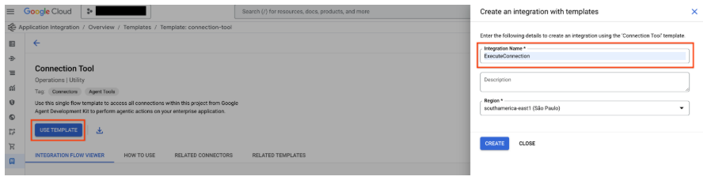
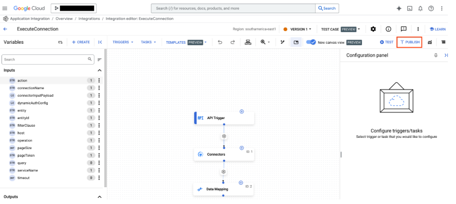

This agent connects to the Jira Cloud using Google Application Integration workflow and Integrations Connector

**Instructions to connect to an agent:**

**Use Integration Connectors**

Connect your agent to enterprise applications using [Integration Connectors](https://cloud.google.com/integration-connectors/docs/overview).

**Steps:**

1. To use a connector from Integration Connectors, you need to [provision](https://console.cloud.google.com/) Application Integration in the same region as your connection by clicking on "QUICK SETUP" button.
   Google Cloud Tools
   

1. Go to [Connection Tool](https://console.cloud.google.com/) template from the template library and click on "USE TEMPLATE" button.
   

1. Fill the Integration Name as **ExecuteConnection** (It is mandatory to use this integration name only) and select the region same as the connection region. Click on "CREATE".

1. Publish the integration by using the "PUBLISH" button on the Application Integration Editor.
   

**References:**

https://google.github.io/adk-docs/tools/google-cloud-tools/#application-integration-tools
