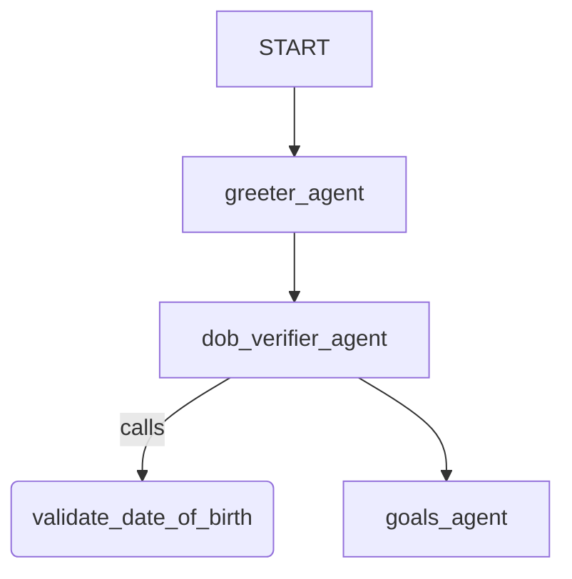

# Live Workflow Sample

## Overview

This sample composes three short, single-purpose **live (voice) agents** into a
graph-based workflow:

1. `greeter_agent` — greets and confirms the caller's name.
1. `dob_verifier_agent` — captures and validates the caller's date of birth
   (using the `validate_date_of_birth` tool).
1. `goals_agent` — once identity is verified, delivers the call goals and wraps
   up the conversation.

Each stage runs in `mode='task'` and hands a typed result to the next
(`GreeterOutput`, `DobOutput`). The stages are wired directly into the
workflow's `edges`, so the framework runs them in order.

## Sample Inputs

- `Hi, yes, this is John Doe`

  Confirms identity so `greeter_agent` can complete and hand off.

- `My date of birth is July 12th, 1985`

  Triggers `validate_date_of_birth` in `dob_verifier_agent`; this DOB matches
  the mocked record and verifies the caller.

- `No, no other questions. Thanks!`

  Lets `goals_agent` wrap up the call and end with "Goodbye.".

## Graph



## How To

1. **Sequence live agents with `mode='task'`**: Each stage is an `Agent` set to
   `mode='task'`, so it runs its own turn-taking loop and completes before the
   next stage begins. Because the agents use a live model
   (`gemini-live-2.5-flash-native-audio`), the whole workflow runs as a voice
   conversation.

1. **Pass typed handoffs between stages**: Give each stage an `output_schema`
   (e.g. `GreeterOutput`, `DobOutput`) so its result is a validated, typed value
   that the next stage receives as input.

1. **Sequence the stages directly in `edges`**: Wire the agents into the
   `Workflow` edges in order; no routing functions are needed for a linear flow:

   ```python
   root_agent = Workflow(
       name='live_workflow',
       edges=[
           (START, greeter_agent),
           (greeter_agent, dob_verifier_agent),
           (dob_verifier_agent, goals_agent),
       ],
   )
   ```

1. **Run the agent** with the ADK web interface and start a Live Session:

   ```bash
   uv run adk web contributing/samples/live/live_workflow
   ```

1. **Evaluate the workflow in live mode**: `test_config.json` and
   `live_workflow.evalset.json` score the workflow with an `llm_audio` user
   simulator that adapts to each stage instead of following a fixed script.

   1. Install the eval extra: `uv pip install -e ".[eval]"`.
   1. Add a `.env` in this directory with Vertex AI credentials (see
      `live_bidi_streaming_single_agent/.env`). The project needs access to both
      the Live API and Gemini TTS models.
   1. Run the eval:
      ```bash
      uv run adk eval \
        contributing/samples/live/live_workflow \
        contributing/samples/live/live_workflow/live_workflow.evalset.json \
        --config_file_path contributing/samples/live/live_workflow/test_config.json
      ```

## Related Guides

- [Task-mode Agents](../../../../docs/guides/agents/llm_agent/task.md) - How
  `mode='task'` agents run their own loop and complete with a typed result.
- [Workflow](../../../../docs/guides/workflow/workflow/index.md) - Building
  graph-based workflows with a `Workflow` root agent.
- [Graph](../../../../docs/guides/workflow/graph/index.md) - Defining nodes and
  sequencing them with `edges`.
