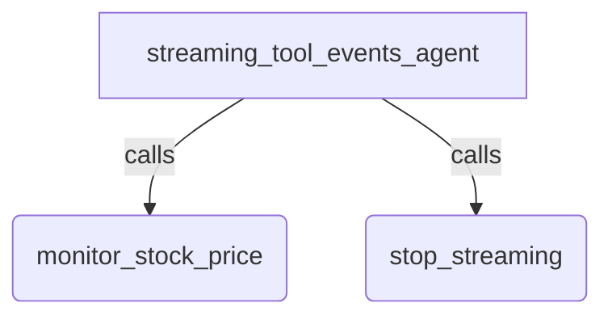

# Streaming Tool Events

**In a streaming tool, `yield Event(message=...)` to talk to the user directly,
and `yield <value>` to give the model a result. Mix and match, in any order.**

## Overview

A streaming tool reports progress to the user while streaming results to the
model, so narrating a long-running tool costs no model turn. Only supported in
streaming (live) agents/api.

## Sample Inputs

- `Help me monitor the stock price for $XYZ stock.`

  *The tool tells you directly that it connected to the feed, without going
  through the model. The price alerts do go to the model, and it reports them
  in its own words.*

- `Stop monitoring $XYZ.`

  *The model calls `stop_streaming`, which cancels the background monitor.*

## Graph



## How To

Write an `async` generator and put it in `tools`. The yielded type picks the
audience:

```python
async def monitor_stock_price(stock_symbol: str) -> AsyncGenerator[Any, None]:
  """Starts a background monitor for the price of the given stock_symbol."""
  yield Event(message=f"Connected to the {stock_symbol} price feed.")
  yield f"the price for {stock_symbol} is 300"
  yield f"the price for {stock_symbol} is 900"
  yield Event(message="That is my last update for now.")
```

Key points:

- **User updates**: yield `Event(message=...)` to send a message straight to
  the client. `message` takes a string, a `types.Part` or a `types.Content`.
  Framework metadata (`author`, `branch`, `invocation_id`, the content role)
  is filled in for you; any other field you set on the event is ignored with a
  warning, and the message is still delivered.
- **Model results**: yield a plain value (`str`, `dict`, ...) to send a
  `FunctionResponse` back to the model.
- **Side effects**: use `tool_context.actions`, not the event.

### Where the message goes

The message is streamed to your client and appended to the session. It does
not go over the live connection, so it consumes no model turns or tokens
during the active turn and cannot derail the model's reasoning mid-task. It is
ordinary session history, though, so the model does see it once the history is
replayed on the next connect.

## Related Guides

- [Event and NodeInfo](../../../../docs/guides/events/event/index.md) - How
  `Event` carries content, actions and metadata, including the `message` field
  used here.
- [live_bidi_streaming_tools_agent](../live_bidi_streaming_tools_agent/readme.md) -
  The streaming tool basics this sample builds on, including `input_stream` and
  `stop_streaming`.
