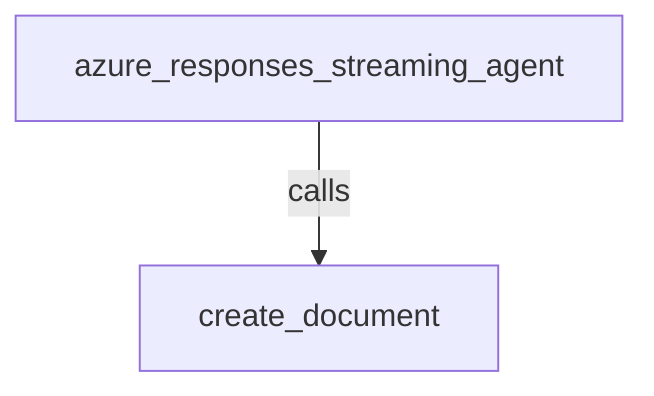

# Azure Responses Partial Function-Call Streaming

## Overview

This sample provides a small document-writing agent for testing streamed
function-call arguments. Azure OpenAI Responses is the default provider. The
`create_document` tool has a nested, deliberately detailed Pydantic input
schema, so the model sends enough JSON for partial function-call events to be
visible in the Dev UI and in `run.py`.

The tool writes the generated document to `generated_docs/` inside this sample
directory. It sanitizes the requested filename to keep the example local to
that output directory.

## Setup

Install the OpenAI Responses extra from the repository root:

```bash
uv sync --extra extensions
```

Configure Azure. `AZURE_OPENAI_ENDPOINT` is optional when
`AZURE_RESOURCE_NAME` is set; the sample derives the standard Azure endpoint
from the resource name.

```bash
export AZURE_API_KEY="your-azure-api-key"
export AZURE_RESOURCE_NAME="your-azure-resource-name"
export AZURE_MODEL_DEPLOYMENT="your-model-deployment"
```

For a non-standard endpoint, set it explicitly:

```bash
export AZURE_OPENAI_ENDPOINT="https://your-resource.openai.azure.com"
```

Do not commit API keys or `.env` files.

## Run With Dev UI

The Dev UI discovers `agent.py` from the sample directory. Enable streaming
in the UI, then ask the agent to create a document.

```bash
uv run --extra extensions adk web contributing/samples/models/azure_responses_streaming
```

Open the URL printed by `adk web`, select the sample agent, and send:

`Create a detailed onboarding guide for backend engineers with four sections, references, and a rollout checklist.`

The UI should show partial function-call content before the final tool call,
followed by the tool result and the generated Markdown path.

## Run `run.py`

`run.py` uses the same `agent.py`, forces `StreamingMode.SSE`, and prints each
text event and function-call delta. Run it from the repository root:

```bash
uv run --extra extensions python contributing/samples/models/azure_responses_streaming/run.py
```

You can provide a custom prompt:

```bash
uv run --extra extensions python contributing/samples/models/azure_responses_streaming/run.py \
  Create a security review document with threat model, controls, testing, and remediation sections.
```

Look for lines such as:

```text
[function_call] partial=True ... partial_args=["$.filename='technical_design_brief.md'"] args=None
[function_call] partial=True ... partial_args=["$.sections[0].heading='Architecture'"] args=None
[function_call] partial=False ... partial_args=[] args={'filename': 'technical_design_brief.md', ...}
```

## Sample Inputs

- `Create a technical design brief for a document streaming feature with architecture, API contract, rollout, and testing sections.`

- `Create a detailed onboarding guide for backend engineers with four sections, references, and a rollout checklist.`

- `Create a security review document with a threat model, controls, testing, and remediation sections.`

## Graph



## How To

- `agent.py` builds the Azure Responses model lazily, so the optional OpenAI
  dependency is only imported when the sample starts.
- `DocumentRequest` and `DocumentSection` provide a nested tool schema. Ask for
  multiple detailed sections to make raw argument fragments easy to observe.
- `run.py` enables `StreamingMode.SSE` and prints `partial_args` separately
  from the final parsed `FunctionCall.args`.
- The Dev UI uses the same `agent.py`; its streaming toggle controls the
  request path, while `run.py` is a deterministic terminal harness.

## Related Guides

- [Function tools sample](../../tools/function_tools/README.md) - Register
  typed Python functions as agent tools.
- [LLM agent single-turn mode](../../../../docs/guides/agents/llm_agent/single_turn.md) -
  Configure a basic LLM agent.
- [Event guide](../../../../docs/guides/events/event/index.md) - Inspect the
  events emitted by an agent run.
