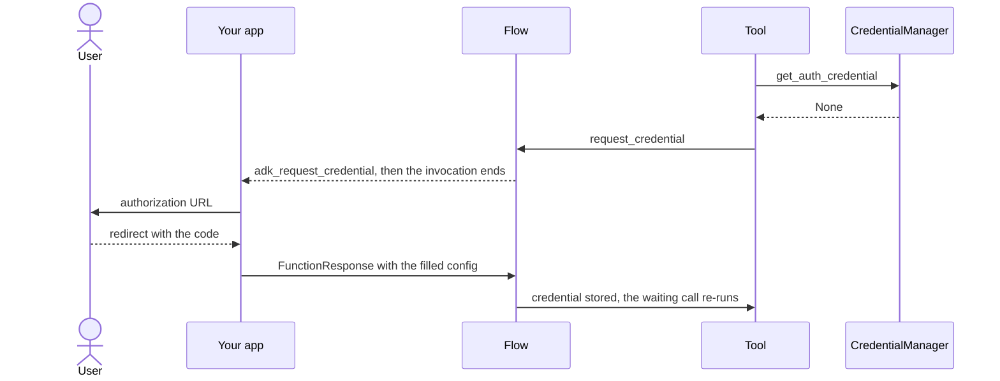

# AuthConfig and authenticated tools

A tool that calls a third-party API on the user's behalf declares an
`AuthConfig`. ADK pauses the run to collect the credential, then resumes the
same tool call once it arrives.

## Introduction

A tool that reads someone's calendar, mailbox, or documents needs a credential
belonging to that person. Only the end user can grant it, and granting it means
leaving the agent: opening a consent screen and coming back with a redirect.
That round trip cannot happen inside a tool call, so ADK models it as an
interruption. The tool declares what it needs and returns a placeholder, and the
invocation ends carrying a request for credentials. The application runs the
consent flow and starts a new run with the answer, and ADK re-executes the tool
call that was waiting.

Two classes describe what is needed, and `AuthConfig` pairs them:

*   `AuthScheme` says how the API expects to be authenticated. It is a union of
    `SecurityScheme` from `fastapi.openapi.models` (`APIKey`, `HTTPBase`,
    `OAuth2`, and the rest), `OpenIdConnectWithConfig`, and `CustomAuthScheme`.
*   `AuthCredential` is the secret. `auth_type` picks the shape (`API_KEY`,
    `HTTP`, `OAUTH2`, `OPEN_ID_CONNECT`, `SERVICE_ACCOUNT`) and the matching
    field (`api_key`, `http`, `oauth2`, `service_account`) holds it.

`AuthenticatedFunctionTool`, `BaseAuthenticatedTool`, and `McpTool` all take an
`AuthConfig` and delegate to `CredentialManager`. The auth request processor in
the LLM flow pauses the invocation and later resumes the waiting call, and a
`BaseCredentialService` remembers the credential between turns.

## Get started

This agent has one tool that needs an OAuth2 access token. Running it prints the
authorization URL, waits for you to paste the redirect you land on, and then
finishes the original request.

```python
import asyncio

from fastapi.openapi.models import OAuth2
from fastapi.openapi.models import OAuthFlowAuthorizationCode
from fastapi.openapi.models import OAuthFlows
from google.adk.agents import LlmAgent
from google.adk.apps import App
from google.adk.auth import AuthConfig
from google.adk.auth import AuthCredential
from google.adk.auth import AuthCredentialTypes
from google.adk.auth import OAuth2Auth
from google.adk.auth.credential_service.in_memory_credential_service import InMemoryCredentialService
from google.adk.runners import Runner
from google.adk.sessions import InMemorySessionService
from google.adk.tools.authenticated_function_tool import AuthenticatedFunctionTool
from google.genai import types

auth_config = AuthConfig(
    auth_scheme=OAuth2(
        flows=OAuthFlows(
            authorizationCode=OAuthFlowAuthorizationCode(
                authorizationUrl="https://provider.example.com/authorize",
                tokenUrl="https://provider.example.com/token",
                scopes={"documents.read": "Read your documents"},
            )
        )
    ),
    raw_auth_credential=AuthCredential(
        auth_type=AuthCredentialTypes.OAUTH2,
        oauth2=OAuth2Auth(
            client_id="YOUR_CLIENT_ID",
            client_secret="YOUR_CLIENT_SECRET",
            redirect_uri="http://localhost:8080/callback",
        ),
    ),
    credential_key="documents_api",
)


def list_documents(folder: str, credential: AuthCredential) -> list[str]:
  """Lists the documents in a folder."""
  access_token = credential.oauth2.access_token
  # Call the provider's API with access_token here.
  return [f"{folder}/report.pdf"]


agent = LlmAgent(
    name="documents_agent",
    instruction="Use list_documents to answer questions about the user's files.",
    tools=[
        AuthenticatedFunctionTool(func=list_documents, auth_config=auth_config)
    ],
)

runner = Runner(
    app=App(name="documents_app", root_agent=agent),
    session_service=InMemorySessionService(),
    credential_service=InMemoryCredentialService(),
)


async def main():
  session = await runner.session_service.create_session(
      app_name="documents_app", user_id="user"
  )
  message = types.Content(
      role="user", parts=[types.Part(text="What is in my reports folder?")]
  )

  while True:
    auth_call = None
    async for event in runner.run_async(
        user_id="user", session_id=session.id, new_message=message
    ):
      for function_call in event.get_function_calls():
        if function_call.name == "adk_request_credential":
          auth_call = function_call
      if event.content and event.content.parts:
        for part in event.content.parts:
          if part.text:
            print(part.text)

    if auth_call is None:
      break

    # The run paused. Send the user through consent and hand back the redirect.
    requested = auth_call.args["authConfig"]
    oauth2 = requested["exchangedAuthCredential"]["oauth2"]
    print("Open this URL:", oauth2["authUri"])
    oauth2["authResponseUri"] = input("Paste the URL you landed on: ")

    response = types.Part.from_function_response(
        name="adk_request_credential", response=requested
    )
    response.function_response.id = auth_call.id
    message = types.Content(role="user", parts=[response])


asyncio.run(main())
```

The `credential` parameter is supplied by the framework and hidden from the
model, so the model only sees `folder`. The `adk web` UI runs the consent step
for you; the loop above is what a custom client does instead.

## How it works

### Declaring that a tool needs credentials

`AuthenticatedFunctionTool` wraps a plain function; `BaseAuthenticatedTool` is
the class-based equivalent, where you implement `_run_async_impl` and receive
the credential as a keyword argument. Both ask a `CredentialManager` for a
credential first, and when there is none they request one and return
`response_for_auth_required` (default `"Pending User Authorization."`) instead
of running your code. A tool can also do this by hand, with
`tool_context.request_credential` and `tool_context.get_auth_response`. The
first needs a `function_call_id`, so it only works inside a tool; from an agent
callback use `save_credential` and `load_credential`.

### The pause and resume



1.  The tool asks `CredentialManager.get_auth_credential`. A raw credential that
    is already usable, an API key or an HTTP credential, is returned as is and
    nothing pauses. Otherwise it checks the credential service, then the auth
    response in session state, then whether the scheme is a client-credentials
    flow needing no user at all. For an authorization-code flow with nothing
    stored, it returns `None`.
2.  The tool calls `request_credential`. `AuthHandler.generate_auth_request`
    builds the authorization URL for OAuth2 and OIDC schemes and writes it to
    `exchanged_auth_credential.oauth2.auth_uri`, with the `state` and, when
    `code_challenge_method` is `"S256"`, a PKCE `code_verifier`. The config is
    parked in `event_actions.requested_auth_configs`, keyed by the id of the
    tool call that is waiting.
3.  The flow emits a separate event holding one long-running function call named
    `adk_request_credential` per request. Its arguments are `functionCallId`,
    the waiting tool call, and `authConfig`, the config from step 2. Keys are
    camelCase because the config is dumped by alias. The flow then ends the
    invocation, which is what "pauses" the run.
4.  Your application reads `authConfig.exchangedAuthCredential.oauth2.authUri`,
    sends the user there, and collects the redirect.
5.  You resume with a new run whose message is a user `Content` containing a
    `FunctionResponse` named `adk_request_credential`. Its response is the same
    config with the answer filled into `exchangedAuthCredential`: either
    `authResponseUri`, the full redirect URL including the code, or a ready
    `accessToken`.
6.  Before the next model call, the auth request processor matches the response
    to its request, stores the credential under `temp:<credential_key>` in
    session state — exchanging the authorization code for a token first, for
    OAuth2 and OIDC — and re-executes the tool call that was waiting.

Two details decide whether the resume works. The `FunctionResponse` id must be
the id of the `adk_request_credential` call, not of the tool call waiting on it;
that id travels separately, in `functionCallId`. And the resume must be the most
recent event with content and be authored by `user`, because that is the only
event the processor looks at.

### Where the credential is stored

Step 6 writes to a `temp:`-prefixed state key. Temp state is ephemeral by
design: session services keep it for the current invocation and do not persist
it. On its own it unblocks the waiting tool call and nothing more, so the next
turn asks the user to consent again.

A credential service is what makes consent stick. Pass one to the runner, as the
example above does. `CredentialManager` then saves the exchanged credential
under `credential_key` and reloads it on later calls, refreshing an expired
OAuth2 token rather than prompting again. `SessionStateCredentialService` is the
alternative, keeping the credential in session state under the same key.

## Configuration options

| Option | Type | Default | Description |
| --- | --- | --- | --- |
| `auth_scheme` | `AuthScheme` | *required* | How the API authenticates. For an authorization-code flow it carries the authorization and token URLs and the scopes, which the authorization URL is built from. |
| `raw_auth_credential` | `AuthCredential \| None` | `None` | What you configured, such as an OAuth client id and secret. Required for OAuth2 and OIDC schemes; for an API key or HTTP credential it is the credential itself, and no consent is needed. |
| `exchanged_auth_credential` | `AuthCredential \| None` | `None` | The working copy ADK and the client fill in: the authorization URL and `state` on the way out, the redirect or access token on the way back. Leave it unset when constructing the config. |
| `credential_key` | `str \| None` | derived | The key the credential is stored under, scoped to the app and user. Left unset it is derived from a digest of the scheme and the raw credential — stable, but opaque, and it changes whenever either does. Set it explicitly. |

## Limitations

*   **Experimental.** `AuthenticatedFunctionTool`, `BaseAuthenticatedTool`,
    `CredentialManager`, the credential services, and the credential exchangers
    are all experimental. They are on by default and warn once on first use, but
    their APIs may change.
*   **The OAuth2 helpers need `authlib`.** Without it no authorization URL is
    generated and no code is exchanged for a token; the credential passes
    through unchanged and the client must run the OAuth flow itself.
*   **Session state is not a secret store.** `SessionStateCredentialService`
    puts tokens wherever session state lives.
*   **`AuthConfig.get_credential_key()` is deprecated.** Set `credential_key`.

## Related samples

*   [OAuth with the Calendar API](../../../../contributing/samples/integrations/oauth_calendar_agent)
*   [OAuth2 client credentials](../../../../contributing/samples/integrations/oauth2_client_credentials)
*   [MCP toolset auth, with the resume loop](../../../../contributing/samples/mcp/mcp_toolset_auth)
*   [API key auth on a workflow node](../../../../contributing/samples/workflows/auth_api_key)
