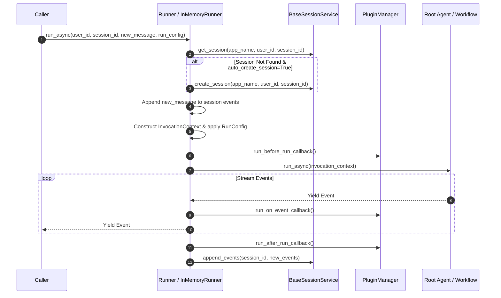

# Runner and InMemoryRunner

`Runner` is the top-level execution engine ADK uses to manage session lifecycles, resolve persistent state, dispatch agent invocations, and stream events back to callers. `InMemoryRunner` is the default in-memory implementation suitable for local development, CLI applications, and unit testing.

## Introduction

Executing an LLM agent or workflow involves coordinating session storage, artifact management, plugin callbacks, and multi-turn message state. Directly instantiating flows or managing raw session objects mixes execution infrastructure with agent business logic.

`Runner` acts as the execution boundary between external callers and internal ADK agent trees. A runner binds a root agent or `App` container to session, memory, artifact, and credential services. It provides standard execution methods (`run_async`, `run`, `run_live`, `run_debug`) that handle session lookup/creation, user event append, context assembly, plugin hook dispatch, and structured event streaming (`Event`).

ADK provides `InMemoryRunner` for development with built-in in-memory session and artifact services, while production deployments use `Runner` with persistent services (e.g. database-backed session stores).

## Get started

Wrap a root agent in an `App`, attach it to an `InMemoryRunner`, create a session, and invoke `run_async` with a structured `types.Content` message:

```python
root_agent = LlmAgent(
    name="greeter",
    instruction="Greet users politely and answer their questions.",
)

app = App(
    name="greeter_app",
    root_agent=root_agent,
)

runner = InMemoryRunner(app=app)

# In an async function:
# 1. Create a session explicitly using the session service
session = await runner.session_service.create_session(
    app_name=app.name,
    user_id="user_123",
    session_id="session_456",
)

# 2. Run agent turn with the created session
async for event in runner.run_async(
    user_id="user_123",
    session_id=session.id,
    new_message=types.Content(
        role="user",
        parts=[types.Part.from_text(text="Hello, ADK!")],
    ),
):
  if event.content and event.content.parts:
    for part in event.content.parts:
      if part.text:
        print(event.author, part.text)
```

The runner retrieves session `session_456` under application `greeter_app`, appends the user message, executes `root_agent`, and yields generated `Event` objects containing model responses and tool outputs.

## How it works

The execution lifecycle coordinates between `Runner`, `BaseSessionService`, `PluginManager`, `InvocationContext`, and the root `BaseAgent`:



1. **Session Resolution & Normalization:** `Runner` normalizes its root target to an `App`. On `run_async`, it retrieves the active `Session` from `session_service` using `app.name`, `user_id`, and `session_id`. If the session is missing and `auto_create_session=True`, a new session is created automatically; otherwise `SessionNotFoundError` is raised.
2. **Context & Event Ingestion:** The caller's `new_message` is appended as a user `Event`. `Runner` constructs an `InvocationContext` linking session state (`app:`, `user:`, `temp:`), artifact service, memory service, and plugin manager.
3. **Execution & Event Streaming:** The runner executes the root agent generator. Generated `Event` instances pass through `PluginManager.run_on_event_callback()` before being yielded to the caller.
4. **Session Persistence & Compaction:** Produced events are persisted to `session_service`. If `events_compaction_config` is set on `App`, event compaction runs after iteration completes.

## Configuration options

`Runner` and `RunConfig` introduce the following options:

### Runner Options

Constructor arguments passed when initializing `Runner(...)` or `InMemoryRunner(...)`:

| Option | Type | Default | Description |
| :--- | :--- | :--- | :--- |
| `app` | `App \| None` | `None` | Recommended entry point: the `App` container binding root agent, plugins, and app-wide configs. |
| `agent` | `BaseAgent \| None` | `None` | Legacy root agent parameter (wrapped into an `App` internally). Mutually exclusive with `app`. |
| `app_name` | `str \| None` | `None` | Application name. Optional override for `app.name`. Defaults to `"InMemoryRunner"` for `InMemoryRunner`. |
| `session_service` | `BaseSessionService` | *(required for Runner)* | Session storage backend for retrieving and persisting conversation sessions. |
| `memory_service` | `BaseMemoryService \| None` | `None` | Long-term memory backend for cross-session retrieval. |
| `artifact_service` | `BaseArtifactService \| None` | `None` | Service for storing binary payloads and files outside session events. |
| `auto_create_session` | `bool` | `False` | Automatically create a new session if `session_id` is not found during `run_async`. |
| `plugins` | `list[BasePlugin] \| None` | `None` | Deprecated on `Runner`: pass plugins on `App(plugins=[...])` instead. |

### RunConfig Options

Passed per-invocation to `runner.run_async(..., run_config=RunConfig(...))`:

| Option | Type | Default | Description |
| :--- | :--- | :--- | :--- |
| `custom_metadata` | `dict[str, Any] \| None` | `None` | Custom metadata keys attached to `InvocationContext`. |
| `get_session_config` | `GetSessionConfig \| None` | `None` | Fine-grained session retrieval and event window loading configuration. |
| `model_input_context` | `list[types.Content] \| None` | `None` | Transient unpersisted context added to model input for the current invocation. |
| `max_llm_calls` | `int` | `500` | Maximum limit on LLM calls per run execution. |

## Advanced applications

### Custom persistent runner

In production, pass database-backed session and memory services to `Runner` to serve persistent sessions:

```python
from google.adk.apps import App
from google.adk.runners import Runner
from google.adk.sessions import DatabaseSessionService

app = App(name="customer_support", root_agent=root_agent)
session_service = DatabaseSessionService(db_url="postgresql://...")

runner = Runner(
    app=app,
    session_service=session_service,
)
```

### Automatic session creation

By default, calling `runner.run_async` with a non-existent `session_id` raises `SessionNotFoundError`. To automatically create a new session when one is missing without an explicit `create_session` call, set `auto_create_session=True` when instantiating `Runner` or `InMemoryRunner`:

```python
runner = InMemoryRunner(app=app, auto_create_session=True)
```

## Limitations

*   **App versus Bare Agent:** `Runner(agent=...)` wraps the agent in an unvalidated `App` without `context_cache_config`, `events_compaction_config`, or `resumability_config`. Always pass an `App` via `app=` for production applications.
*   **InMemoryRunner Volatility:** `InMemoryRunner` uses `InMemorySessionService` by default. Session state is stored in memory and lost when the process terminates.

## Related guides & samples

*   [App Container](../../apps/app/index.md) — Guide on `App` configuration, plugins, and cross-cutting features.
*   [Runner Live Streaming](live.md) — Guide on real-time bidirectional streaming with `run_live` and `LiveRequestQueue`.
*   [Session and BaseSessionService](../../sessions/session/index.md) — Guide on session storage backends and state scoping.
*   [Agent-to-Agent Sample](../../../../contributing/samples/a2a/a2a_basic/agent.py) — Multi-agent application executed via `Runner`.
