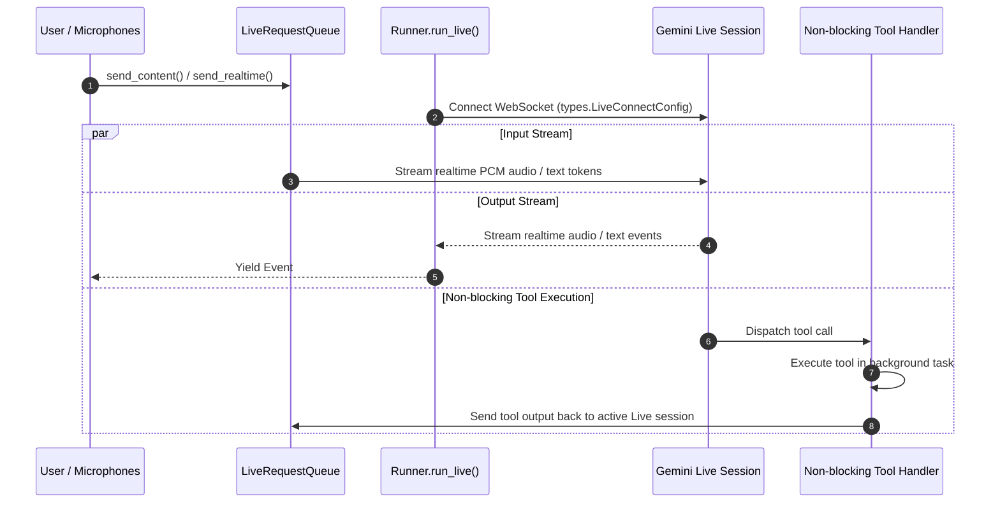

# Runner Live Streaming (run_live)

`Runner.run_live` is the real-time execution mode ADK uses to establish persistent bidirectional streaming sessions with Gemini Multimodal Live API models. It coordinates real-time audio/text streaming, `LiveRequestQueue` message ingestion, and non-blocking background tool execution.

## Introduction

Standard chat models operate via turn-based request-response cycles. For real-time voice, conversational audio, and streaming multimodal applications, waiting for complete turns introduces prohibitive latency. Gemini Live models require persistent, low-latency WebSocket or gRPC connections capable of receiving continuous PCM audio frames while simultaneously streaming back audio responses and executing tools.

The `run_live` subsystem resolves this by connecting `Runner` to Gemini Multimodal Live endpoints. Callers pass a [`LiveRequestQueue`](../../live/live_request_queue/index.md) to supply real-time user audio or text chunks. The runner maintains an active streaming session, routes non-blocking tool calls to background execution tasks without interrupting the audio stream, and yields real-time model content events (`Event`).

## Get started

Attach an `LlmAgent` to an `App`, connect it to an `InMemoryRunner`, and drive a live session using `LiveRequestQueue`:

```python
root_agent = LlmAgent(
    name="voice_agent",
    instruction="You are a voice assistant. Answer queries concisely in spoken English.",
)

app = App(name="voice_app", root_agent=root_agent)
runner = InMemoryRunner(app=app)
queue = LiveRequestQueue()

# In an async task:
# Push user text or audio into the queue
queue.send_content(
    content=types.Content(
        role="user",
        parts=[types.Part.from_text(text="Hello! Can you hear me?")],
    )
)

async for event in runner.run_live(
    user_id="user_123",
    session_id="session_live",
    live_request_queue=queue,
):
  if event.content and event.content.parts:
    for part in event.content.parts:
      if part.text:
        print("Live model response:", part.text)
```

The queue allows callers to push PCM audio frames or text messages into the active session asynchronously while `run_live` streams response events back.

## How it works

The live execution lifecycle coordinates between `Runner`, `LiveRequestQueue`, `BaseLlmFlow`, and the Gemini Live API backend:



1. **Connection Setup:** `run_live` establishes a persistent bidirectional connection using `types.LiveConnectConfig` (specifying modalities like `AUDIO` or `TEXT` and voice settings).
2. **Asynchronous Input Ingestion:** `LiveRequestQueue` wraps an `asyncio.Queue[LiveRequest]`. The caller streams audio PCM chunks (`queue.send_realtime()`) or text tokens (`queue.send_content()`), which `run_live` forwards over the open WebSocket.
3. **Event Categorization & Session Filtering:**
   * **Inline Audio Events (`inline_data`):** Streamed directly to callers for low-latency audio playback, but **not** saved to session history to prevent session bloat.
   * **Artifact Media Events (`save_live_blob`):** Video and audio data are saved to artifact storage and persisted to session history when `save_live_blob` is set to `True` on `RunConfig`.
   * **Transcriptions & Tool Calls:** Non-partial transcriptions, usage metadata, and function calls are always saved to session history.
4. **Non-Blocking Background Tools:** When a tool function is invoked during a live stream, the runner dispatches the tool call to a background task so audio output is not blocked. Once complete, tool execution results are pushed back into `LiveRequestQueue` to update the model.

## Configuration options

`run_live` accepts the following configuration parameters:

| Parameter | Type | Default | Description |
| :--- | :--- | :--- | :--- |
| `user_id` | `str \| None` | `None` | User ID for the session. Required if `session` is `None`. |
| `session_id` | `str \| None` | `None` | Session ID for the session. Required if `session` is `None`. |
| `live_request_queue` | `LiveRequestQueue` | *(required)* | Queue used to push real-time user inputs, audio chunks, and tool results into the session. |
| `run_config` | `RunConfig \| None` | `None` | Execution configuration including `speech_config`, `response_modalities`, and `save_live_blob`. |
| `session` | `Session \| None` | `None` | Pre-fetched session instance (deprecated in favor of `user_id` and `session_id`). |

### RunConfig Live Options

Configured via `run_config=RunConfig(...)`:

| Option | Type | Default | Description |
| :--- | :--- | :--- | :--- |
| `speech_config` | `types.SpeechConfig \| None` | `None` | Voice selection and audio encoding configuration for live agents. |
| `response_modalities` | `list[types.Modality] \| None` | `None` | Output modalities returned by the model (`AUDIO` or `TEXT`). |
| `save_live_blob` | `bool` | `False` | Saves live video and audio data to session and artifact service. |
| `session_resumption` | `types.SessionResumptionConfig \| None` | `None` | Configures transparent session resumption mechanism. |
| `tool_thread_pool_config` | `ToolThreadPoolConfig \| None` | `None` | Runs tools in a background thread pool executor to keep event loop responsive. |

## Advanced applications

### Non-blocking streaming tool callback

Tool functions can declare `input_stream: LiveRequestQueue` as a parameter to stream partial tool results or status updates back to the live session while running in the background:

```python
from google.adk.live import LiveRequestQueue
from google.genai import types


async def fetch_stock_ticker(
    symbol: str, input_stream: LiveRequestQueue
) -> dict[str, float]:
  """Fetches live stock price while streaming progress."""
  # Notify live model session that lookup is underway
  input_stream.send_content(
      content=types.Content(
          role="user",
          parts=[
              types.Part.from_text(
                  text=f"Fetching latest price for {symbol}..."
              )
          ],
      )
  )
  # Perform lookup
  return {"symbol": symbol, "price": 154.25}
```

## Limitations

*   **Gemini Live Model Requirement:** `run_live` requires model endpoints that support the Gemini Multimodal Live API (e.g. `gemini-2.0-flash-exp`).
*   **Inline Audio Persistence:** Raw PCM audio blobs (`inline_data`) are intentionally omitted from session storage. To retain session audio and video history, set `save_live_blob=True` on `RunConfig`.

## Related guides & samples

*   [Runner and InMemoryRunner](index.md) — Main guide on standard turn-based runner execution.
*   [LiveRequestQueue](../../live/live_request_queue/index.md) — Guide on real-time input queueing, audio chunking, and non-blocking streaming tools.
*   [App Container](../../apps/app/index.md) — Guide on bundling agents and plugins into an `App`.
*   [Live Bidi Streaming Single Agent](../../../../contributing/samples/live/live_bidi_streaming_single_agent/agent.py) — Sample single-agent real-time streaming application.
*   [Live Non-Blocking Tool Agent](../../../../contributing/samples/live/live_non_blocking_tool_agent/agent.py) — Sample agent using `LiveRequestQueue` in background tool callbacks.
